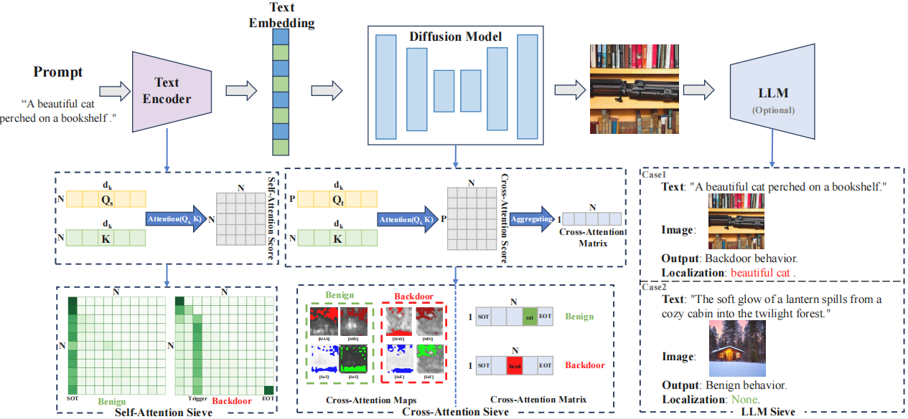
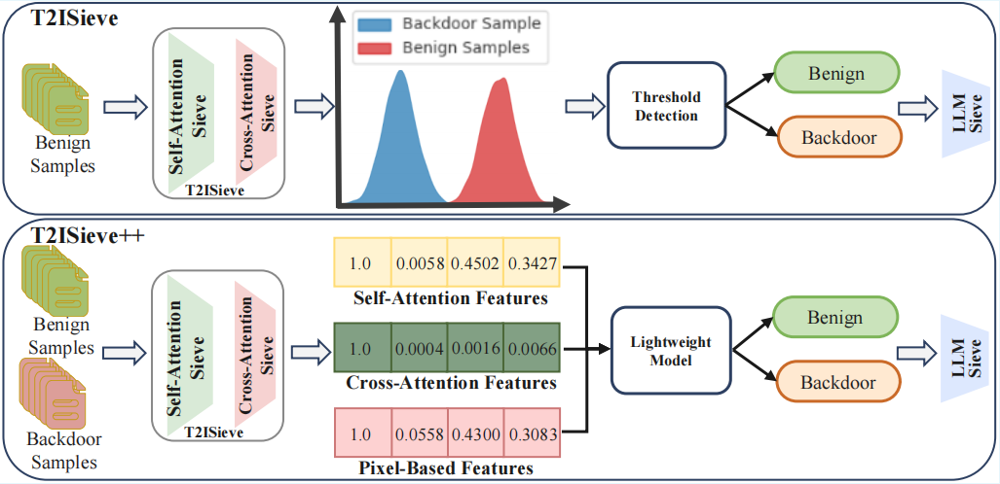

# T2ISieve

## Project Overview

Text-to-image (T2I) diffusion models are widely adopted, with many users and institutions downloading publicly released models from third-party platforms for deployment. However, these models are vulnerable to backdoor attacks, where adversaries manipulate outputs using embedded triggers. To ensure the secure use of publicly available T2I diffusion models, this paper proposes T2ISieve, a framework designed to detect backdoors and localize triggers in backdoored models. Specifically, we first detect the attention shift phenomenon, which indicates that the attention in T2I diffusion models subjected to backdoor attacks undergoes abnormal shifts. Thus, self-attention sieve and cross-attention sieve are designed to capture this phenomenon for lightweight backdoor detection. Furthermore, we integrate large language models (LLMs) with tailored prompts to develop an LLM sieve for precise trigger localization. For backdoor attacks with subtle attention shifts, we further propose T2ISieve++, which employs a trained backdoor detector to identify highly stealthy attacks.

## Workflow



## The difference between T2ISieve and T2ISieve++.


## Main Features

- **Backdoor Detection**: Automatically identifies potential trigger words and abnormal patterns by analyzing self-attention and cross-attention matrices.
- **Visualization Tools**: Generates attention heatmaps and mask overlap analysis to help understand model behavior.
- **LLM Sieve**: Integrates large language models to improve detection accuracy.
- **T2ISieve++**: Advanced backdoor detector using LSTM-based classification for improved accuracy in detecting and classifying various backdoor types (e.g., clean, IBA, Rickrolling, BadT2I, EvilEdit, Villan).


## Installation

1. Clone the repository  
 
  In accordance with the anonymity regulations, we will provide the GitHub repository in the follow-up.


2. Install dependencies  
   ```
   pip install -r requirements.txt
   ```

3. Download required pretrained models (e.g., Stable Diffusion, CLIP) and place them according to the project structure.

## Quick Start

1. **Prepare Data**  
   Place the text prompts to be tested in the `backdoor_detection/data/prompts/test/` directory.

2. **Run Detection Script**  
   For example, to run `Rickrolling.py`:
   ```
   python backdoor_detection/visualization/Rickrolling.py
   ```
   
3. **Run Localization Script**  
   For example, to run `Rickrolling.py`:
   ```
   python backdoor_detection/Localization/Rickrolling.py
   ```

4. **View Results**  
   Both detection results and localization results will be directly printed to the control interface.

5. **Train T2ISieve++ Detector**  
   Run the training script to train the LSTM-based classifier:  
   ```
   python backdoor_detection/localization/slef_cross_floder/train.py
   ```

6. **Predict with T2ISieve++**  
   Run the prediction script to classify backdoors using the trained model:  
   ```
   python backdoor_detection/localization/slef_cross_floder/predict.py
   ```

## Directory Structure

- `backdoor_detection/`  
  - `localization/`: Backdoor localization code  
    - `slef_cross_floder/`: T2ISieve++ training and prediction code  
      - `train.py`: Training script for LSTM classifier  
      - `predict.py`: Prediction script for backdoor classification
  - `visualization/`: Main scripts for visualization and detection  
  - `data/`: Test prompts and images  
  - `models/`: Backdoored models
- `stable-diffusion-v1-4/`  
  **The pretrained Stable Diffusion model files and configurations.**

## Main Dependencies

- Python 3.8+
- torch
- diffusers
- transformers
- spacy
- tqdm
- scikit-learn
- datasets
- torchvision
- matplotlib
- seaborn

## Notes

- Ensure sufficient GPU resources; some detection methods require CUDA.
- Pretrained models must be downloaded and placed in the specified paths.
- LLM-assisted screening requires proper API or local model configuration.
- Most of the backdoor models used in this paper can be downloaded from the comparative literature T2IShield, while other backdoor models can be downloaded from their respective GitHub.

